# 🎬 Inception – 42 School Project  

<p align="center">
  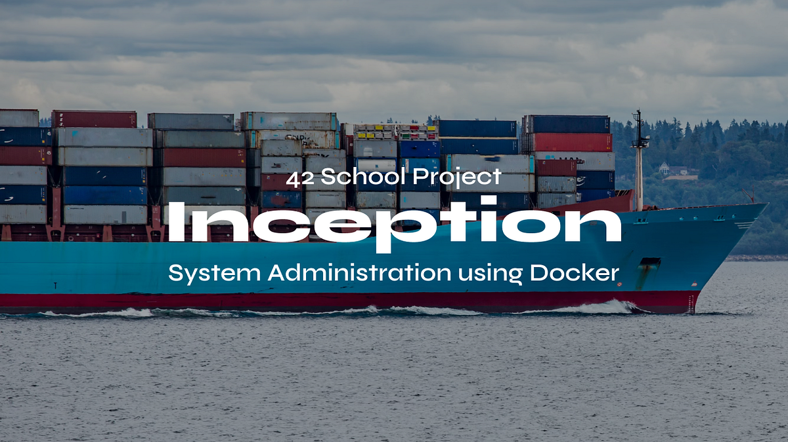
</p>

<p align="center">
  
  
  
  
  
  
  
</p>

<br>

## 📖 Overview

**Inception** is a **DevOps / System Administration** project at **42 School**.  
The challenge: build a **secure, containerized infrastructure** entirely from **scratch** using **Docker Compose**.  

Instead of pulling pre-made images, everything is built via **custom Dockerfiles**.  

> 🐳 This project is your first real step into **containerization, orchestration, and service networking**.  

<br>

## 📚 Table of Contents  

- 🎯 [Goal](#goal)  
- 🛠️ [Technologies](#technologies)  
- 📂 [Structure](#structure)  
- 📊 [Architecture](#architecture)  
- 📸 [Screenshots](#screenshots)  
- 🎥 [Demo](#demo)  
- 🏆 [Grade](#grade)  
- 👨‍💻 [Author](#author)  
- ⭐ [Support](#support)  

<br>

## 🎯 <a id="goal">Goal</a>

Deploy a **mini self-hosted server infrastructure**:  

### ✅  **Nginx** (HTTPS, TLSv1.2+).  
### ✅ **WordPress** with **php-fpm**.  
### ✅ **MariaDB** database.  
### ✅ **Redis** cache.  
### ✅ **FTP server**.  
### ✅ **Adminer** (DB manager).  
### ✅ **Portainer** (Docker GUI).  
### ✅ **Static Website** (bonus).  
### ✅ **Persistent volumes** for DB & WordPress.  

<br>

## 🛠️ <a id="technologies">Technologies</a>

### - 📦 **Docker / Docker Compose** – containerization & orchestration  
### - 🌐 **Nginx** – reverse proxy, HTTPS with self-signed certificate  
### - 🗄️ **MariaDB** – relational database  
### - 📜 **WordPress** – CMS for content  
### - ⚡ **Redis** – caching  
### - 📂 **FTP** – file transfer service  
### - 🛡️ **Adminer** – DB management interface  
### - 🖥️ **Portainer** – Docker container GUI  
### - 📝 **Makefile** – automation (`make`, `make fclean`)  

<br>

## 📂 Structure  

```bash
Inception/
    ├── assets/
    ├── Makefile
    └── srcs/
        ├── docker-compose.yml
        ├── requirements/
        │   ├── mariadb/
        │   ├── nginx/
        │   ├── wordpress/
        │   └── bonus/
        │       ├── ftp/
        │       ├── redis/
        │       ├── adminer/
        │       ├── static-website/
        │       └── portainer/
        └── .env

```

<br>

## 📊 <a id="architecture">Architecture</a>

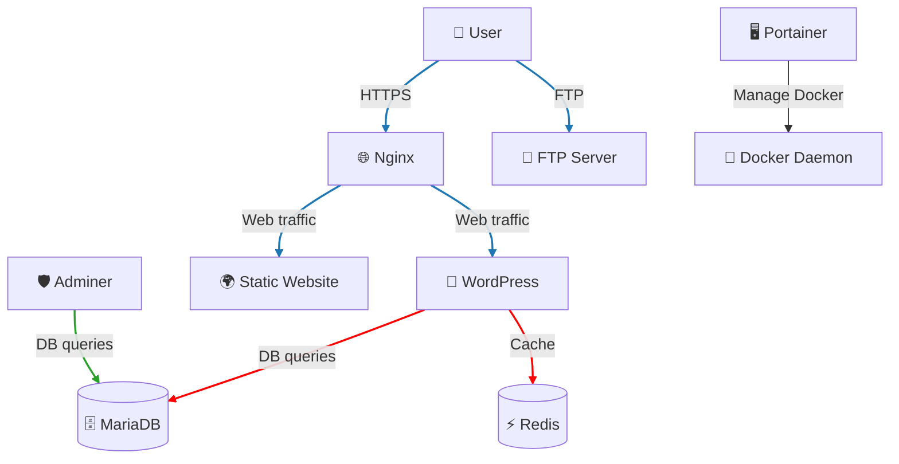

🔑 **Legend:**

* Blue path → Web traffic
* Red path → Database queries
* Green path → Infrastructure management

<br>

## 📸 <a id="screenshots">Screenshots</a>

<p align="center">
  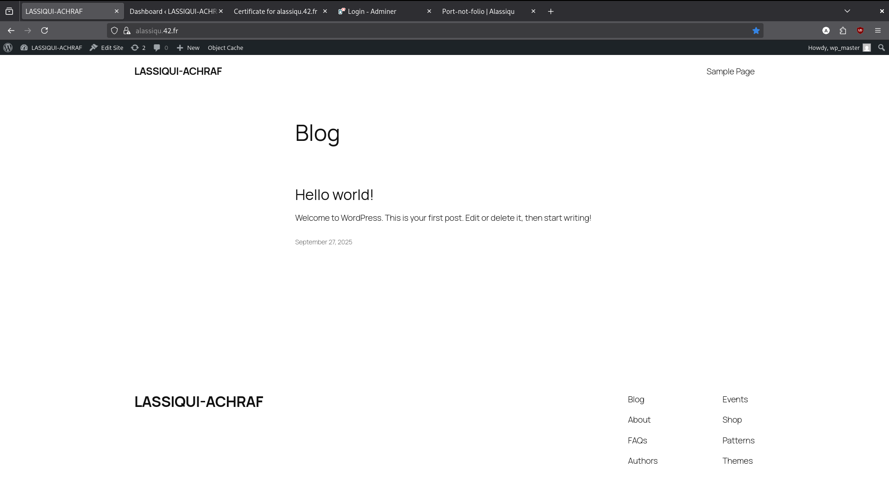  
  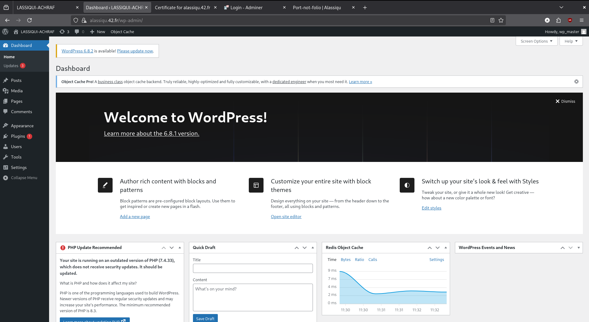  
</p>

<p align="center">
  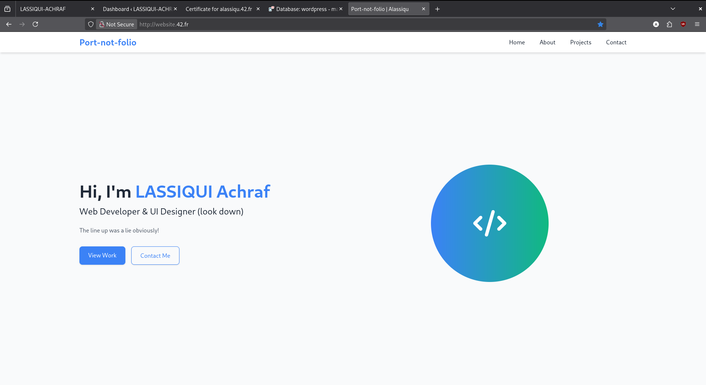  
  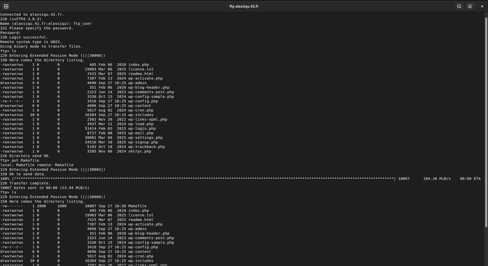  
</p>

<p align="center">
  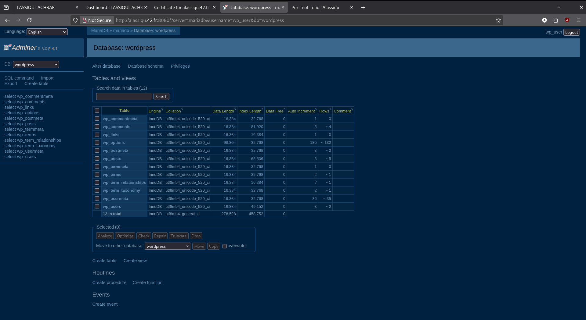  
  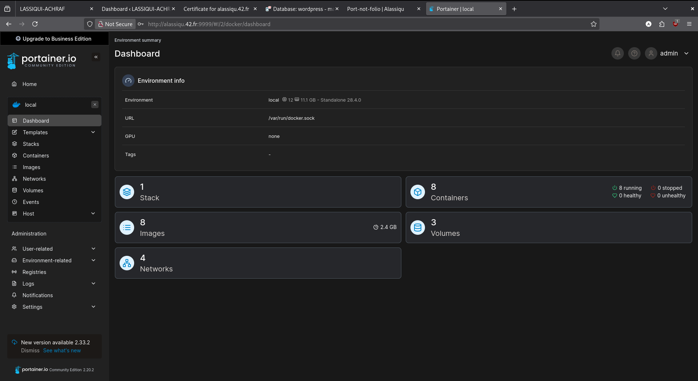  
</p>

<p align="center">
  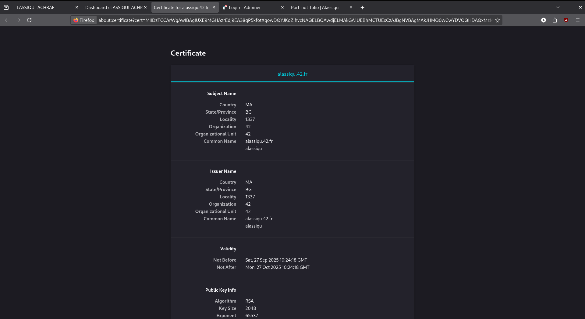  
</p>

<br>

## 🎥 <a id="demo">Demo</a>

<p align="center">
  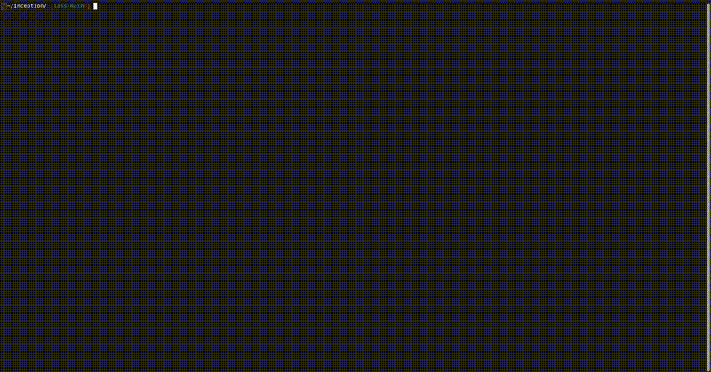  
</p>

<br>

## 🏆 <a id="grade">Grade</a>

<p align="center">
  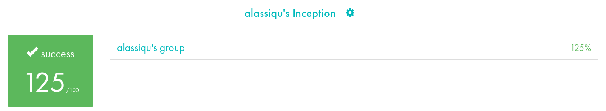  
</p>

<br>

## 👨‍💻 <a id="author">Author</a>

**Achraf Lassiqui** – [@alassiqu](https://github.com/lassachraf)

<br>

## ⭐ <a id="support">Support</a>

If you found this project useful or inspiring, consider giving it a **star** ⭐ on GitHub!

<p align="center">
    <a src="https://github.com/lassachraf/Ineption">
    
    </a>
</p>
